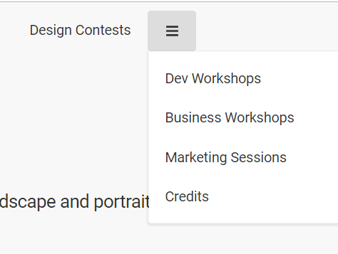

# HTML 5 Semantics practice

First exercice to practice how to get some HTML 5 operational code

# Motivation

This exercise was the opportunity to understand how to clean some HTML code. I was also interested to practice flexboxes, and I tried to work on the CSS code improvement.

# Setup

Click on this link to access the improved version of the website : https://hedical.github.io/HTML-5-Sema…

# Instructions
- **Use HTML 5 semantics** (nav, header, article, section, footer, aside ...)
- **Identifiy** what is a nav element, an article element, a section element
- **Verify title meaning** and change it if needed
- **Add 'alt' elements** to images

## More
- Improve CSS code using flexboxes

# Future Improvements
- Add media queries to get an accessible website for mobile and tablet
- Add a collapsible nav bar for mobile access
    - Example :

- Do more commits on my git hub repository during coding sessions